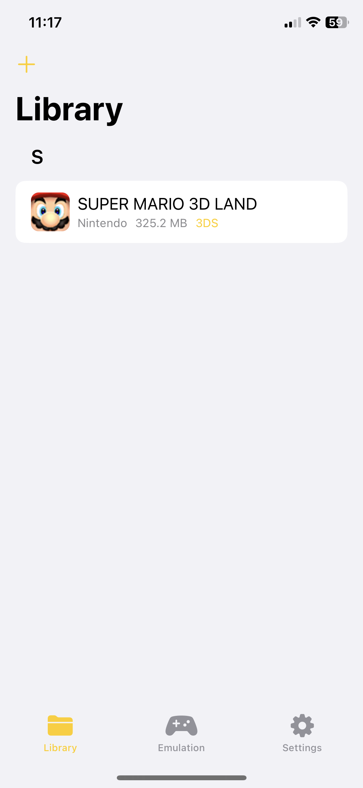
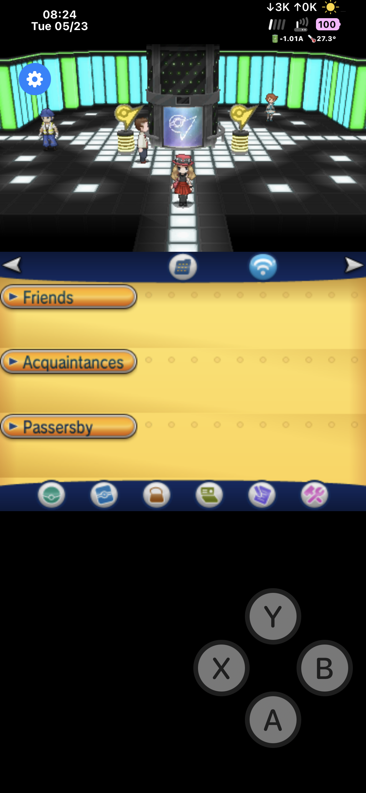
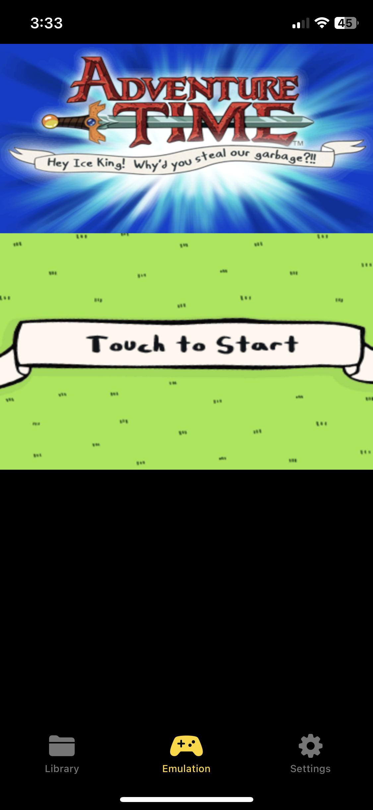

# emuThreeDS
**emuThreeDS** is a Nintendo 3DS emulator for Apple TV, iPad and iPhone based on **[Citra](https://github.com/citra-emu/citra)**.

  
  
  
  
  

## Support
Support the development of **emuThreeDS** by going to the links below!

  
  
    
  

## Building
Go to **[BUILDING.md](resources/markdowns/BUILDING.md)** to see how to build **emuThreeDS**.

## Changelog
Go to **[CHANGELOG.md](resources/markdowns/CHANGELOG.md)** to see changes in the latest release.

## Screenshots

    
    
     
    
